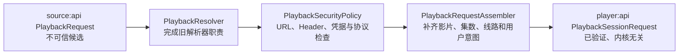
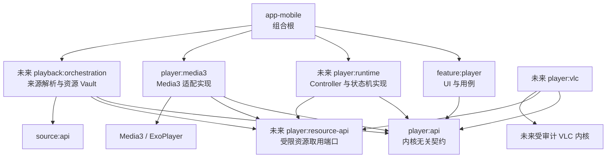
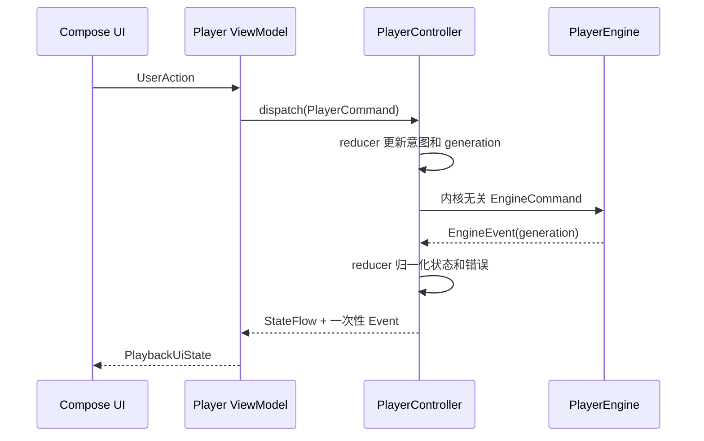
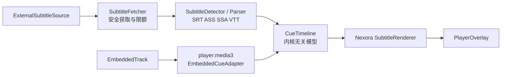
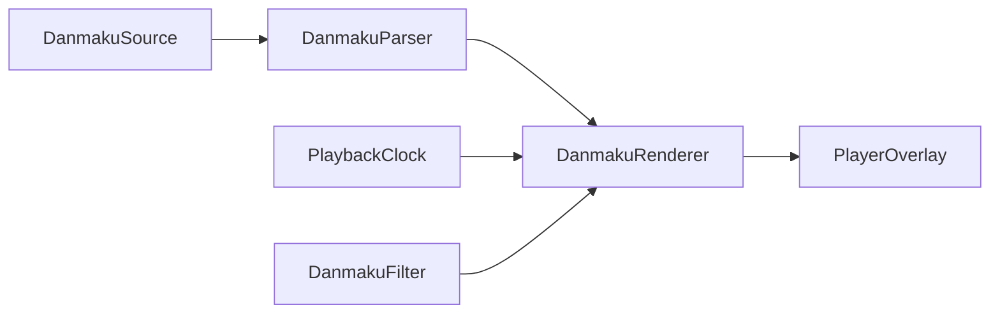

# Nexora 播放器总体架构

状态：`拟定，等待确认`

适用阶段：`M3.5` 设计与后续 `M4` 实施

非目标：本文件不授权编写播放器代码、添加依赖或开发播放 UI。

## 设计原则

1. 数据源结果不等于可信播放器输入。
2. 业务层只依赖 Nexora 自有契约，不依赖 Media3 类型。
3. 播放会话由控制层持有，Activity 只承载界面和系统回调。
4. URL、Cookie、Authorization、Token 和 DRM 凭据按秘密处理。
5. 播放内核、字幕解析、弹幕渲染、历史存储相互解耦。
6. 所有切换和异步回调都可取消，并能识别过期会话。
7. 先建立可测试契约，再接入真实内核。

---

## 1. PlaybackRequest 播放请求模型设计

### 1.1 现状与命名

M3 已有 `source:api.PlaybackRequest`，字段为：

- `sourceKey`
- `flag`
- `url`
- `headers`
- `resolution`（`DIRECT` 或 `REQUIRES_PARSER`）
- `parserUrl`
- `format`

其中 `resolution` 表示“是否仍需解析”，不是视频清晰度。该对象来自旧数据源，字段还可能包含未验证 URL、Cookie 或 Authorization；它只能作为数据源候选，不能直接成为播放器公开 API。

为避免同名和错误信任，M4 建议采用以下流水线：



图中的 `PlaybackResolver` 是来源侧版本化 `PlaybackCandidateResolver` 端口：它只执行已批准的 type 0/1/4 HTTP 和内建安全适配。未知 JAR、JavaScript、Python、需要扩大权限的旧解析器或未批准协议必须返回 `Unsupported`，不得因播放器阶段而绕过 M3.4 隔离策略。

建议在文档和未来代码中把 M3 类型称为 `SourcePlaybackCandidate` 语义，把最终播放器输入命名为 `PlaybackSessionRequest`。是否在 M4 实际重命名现有类型，需在不破坏 M3 契约的前提下单独实施。

### 1.2 最终输入模型

以下是概念模型，不是本阶段代码：

| 分组 | 字段 | 含义与约束 | 主要提供方 |
|---|---|---|---|
| 会话 | `requestId` | 每次准备播放生成的不可复用 ID；用于命令关联和脱敏诊断 | 播放编排层 |
| 内容身份 | `mediaIdentity` | 目标结构为 `sourceKey + vodId + episodeIdentity`；当前 M3 尚无稳定 episode ID，M4 必须扩展来源中立契约 | 数据源层 + 编排层 |
| 来源快照 | `origin` | `sourceName`、线路/集的 ID、名称与 `IdentityQuality`；当前 M3 只能生成部分 best-effort 身份 | 数据源层 |
| 媒体资源 | `resourceRef` | 已验证资源的不透明引用；网络资源至少限制协议、主机和重定向策略 | 安全策略层 |
| 请求策略 | `httpRequestProfileRef` | 指向受控 Header、User-Agent 和重定向规则；不向 UI 暴露值 | 安全策略层 |
| 凭据 | `credentialRef?` | Cookie/Authorization 的短期、不透明句柄 | 安全策略层 |
| 格式提示 | `declaredFormatHint?` | 来源声明的 MIME/容器提示；不可信，最终以播放器探测为准 | 数据源层 |
| 清晰度 | `variants` | 数据源声明的独立 URL 变体；每项只含 resourceRef、ID、显示名和可选高度/码率/编码提示，不含原始 URL | 数据源层 + 编排层 |
| 起播选择 | `initialVariantId?` | 用户或策略选择的初始变体；不代表内核已发现轨道 | 播放器层 |
| 音轨偏好 | `audioPreference?` | 语言、角色或用户上次选择；实际音轨在 prepare 后发现 | 播放器层 |
| 字幕 | `externalSubtitles`、`subtitlePreference?` | 外挂字幕引用与选择偏好；内嵌字幕由内核发现 | 数据源层 + 播放器层 |
| 弹幕 | `danmakuSources` | 集数级弹幕候选引用；配置级 URL 必须先解析成具体候选 | 数据源/弹幕编排层 |
| DRM 预留 | `drmPolicy` | 首期固定为 `Disabled` 或 `UnsupportedConfigDetected`；只表示检测到配置级兼容字段，不携带播放结果 DRM 载荷 | 安全策略层 |
| 用户意图 | `startPositionMs`、`playWhenReady` | 继续观看位置与是否自动开始；数据源不得决定 | 播放用例/历史层 |
| 时效 | `expiresAt?`、`refreshKey?` | 短期签名 URL 的过期提示与重新解析标识；不存秘密 | 数据源层 + 编排层 |

`resourceRef` 不应是可随意打印的普通字符串。推荐的概念类型为：

- `NetworkResourceRef`：脱敏 URI + 受控请求策略引用；
- `LocalContentRef`：仅由用户授权的 Storage Access Framework `content://` 引用；
- 未来其他资源类型必须单独建模并配置能力，不能通过任意 `file://` 绕过访问边界。

所有包含 URI 的对象都必须自定义脱敏 `toString`：只允许记录 scheme、脱敏 host、路径散列和 requestId，不记录查询参数、用户名、密码或完整路径。

当前 `SourceEpisode` 只有 `name + playbackId`，`SourcePlaybackLine` 只有 `name`；两者都没有稳定 ID。M4 必须在 Source 中立契约增加：

- `SourceLineIdentity(value, quality)`；
- `SourceEpisodeIdentity(value, quality)`；
- `IdentityQuality.STABLE` 或 `BEST_EFFORT`。

来源能提供非秘密稳定 ID 时使用 STABLE。若只有易变或带签名的 playbackId，只能用线路非秘密身份、集数序号和显示名生成 best-effort 身份，并明确顺序/名称变化会失配；不得持久化、普通散列或把原始 playbackId 当成稳定 ID。身份含糊时，继续观看应提示重新选择，而不是猜测。

### 1.2.1 资源保险库与取用端口

最终播放器必须取得真实 URL 和请求元数据，但这些秘密不能经过 UI。闭环设计如下：

1. `playback:orchestration` 完成来源解析和安全校验后，将真实 URI、允许的 Header 和短期凭据存入仅内存 `PlaybackResourceVault`。
2. Vault 生成不可枚举且有到期时间的 `resourceRef`；正常 open 时绑定 `sessionId + generation`，换线预检时先绑定 `sessionId + switchOperationId`，提交替换时才原子激活到新 generation；`PlaybackSessionRequest` 只携带这个引用。
3. 未来 `player:resource-api` 只定义窄 `PlaybackResourceProvider` 端口和可关闭 `ResolvedResourceLease`；Feature 不依赖该模块。
4. `player:media3` 仅在创建/执行 DataSource 请求时调用 `resolve(resourceRef)`，取得一次性 lease；lease 中的 URI、普通 Header 和凭据同样使用脱敏包装。
5. Provider 校验调用会话、已激活 generation、到期时间和取消信号；仍处于预检、过期或已撤销的引用不能取得真实资源。
6. 换 generation、取消、stop、Controller close 或超时后立即撤销相关引用和 lease。
7. UI、ViewModel、历史、SavedState、Intent、Bundle、通知、分析和崩溃报告既不持有 Provider，也不能枚举 ref。

`PlaybackResourceProvider` 的实现与 Vault 归 `playback:orchestration`，其端口位于受限 `player:resource-api`；App 组合根只把 Provider 注入 `player:runtime`/`player:media3`。这不是通用秘密仓库，也不允许 Feature 通过 Service Locator 取得。

### 1.3 字段职责

#### 数据源层提供

- 候选媒体 URL 或仍需解析的结果；
- `sourceKey`、`vodId`、线路与集数的身份及展示名称；
- 来源声明的格式、清晰度、码率等提示；
- 外挂字幕和弹幕候选；
- 来源建议的普通请求头、User-Agent 及短期时效；
- 能否直接播放的判断。

数据源提供的是“声明”和“候选”，不能声明最终解码能力、已发现音轨或已经通过安全校验。

#### 可信解析与安全策略层负责

- 在进入播放器前完成 `parserUrl` 对应的解析职责；
- 规范化 URL，并校验 scheme、host、端口、重定向和私网访问策略；
- 拒绝控制字符、超长 Header、非法 Header 和 hop-by-hop Header；
- 把 Cookie、Authorization、Proxy-Authorization 从普通 Header 中剥离为 `credentialRef`；
- 对 User-Agent 做长度和控制字符检查，并选择来源建议值或 Nexora 默认值；
- 生成稳定但不泄密的线路、集数和资源标识；
- 决定明文 HTTP、RTMP、本地内容和 DRM 是否允许；
- 限制字幕、弹幕与资源数量和大小。

建议 M4 新建纯 Kotlin `playback:orchestration` 模块承载这层，依赖 `source:api`、`player:api` 和 `player:resource-api`。它实现 `player:api` 中来源中立的 `PlaybackRequestResolver` 端口，并调用 Source 侧 `PlaybackCandidateResolver`；`player:runtime` 通过该端口发起解析，但不直接依赖 Source DTO。禁止把转换放在 Activity、Composable 或 `player:media3` 内。

#### 播放器层负责

- 真实容器、编码、时长、可 seek 性和直播属性探测；
- 自适应视频轨、音轨和内嵌字幕发现；
- 将内核轨道映射为稳定、内核无关的 Track ID；
- 缓冲、重试、恢复、音频焦点和生命周期；
- 选择清晰度、音轨与字幕；
- 输出播放状态、能力、错误和位置；
- 不保存原始凭据，不执行旧解析器或插件。

### 1.4 Headers、Cookie 与 User-Agent

请求元数据分三类：

| 类型 | 例子 | 处理方式 |
|---|---|---|
| 普通且允许的请求头 | `Referer`、`Origin`、`Accept-Language` | 经过名称和值校验后进入受控请求策略 |
| 专用策略 | `User-Agent` | 使用专门字段；来源只能建议，最终值由策略层决定 |
| 秘密 | `Cookie`、`Authorization`、`Proxy-Authorization` | 转换为不透明 `credentialRef`，不得进入普通 Map |

Cookie/凭据存储建议：

- 首期只保存在内存；
- 按 `session + sourceKey + origin` 分区；
- 有明确到期时间，播放结束或会话释放后清理；
- 只在创建网络请求时由 Credential Provider 注入；
- 跨 origin 重定向必须剥离 Cookie、Authorization、Referer 等敏感信息；
- 不使用全局、无来源隔离的 Cookie 容器；
- 不向 UI、ViewModel、历史库、SavedStateHandle、Bundle、通知、分析或崩溃日志暴露；
- 如未来需要持久登录，必须另立加密凭据 ADR 和威胁模型，不能复用播放历史。

这里的同 origin 精确定义为 `scheme + canonical host + effective port`。HLS/DASH 如需访问不同 CDN host，必须由请求 profile 给出有限 host grant，并对每个重定向和 DNS 解析结果重新执行公网/私网策略；Cookie、Authorization、Referer 和 Origin 默认不随跨 origin 请求继承。

### 1.5 清晰度、线路、音轨与字幕的区别

- “线路”是来源提供的播放入口，例如不同 CDN 或解析方案。
- “数据源清晰度变体”是多个独立 URL；切换时要重新 prepare 并迁移播放位置。
- “自适应清晰度轨”是同一 HLS/DASH manifest 内由播放器探测到的轨道；可通过轨道选择切换。
- 音轨、内嵌字幕同样只能在播放器 prepare 后确认，禁止用来源数组索引当永久 ID。
- 外挂字幕是独立资源，可以在 prepare 前由数据源层声明。

播放器状态应同时暴露 `selectedLine`、`selectedSourceVariant` 和 `selectedVideoTrack`，避免把三者都叫“清晰度”。

### 1.6 DRM 预留

旧配置中的 DRM 字段按 M3 规则继续“可解析、可保留、不执行”。M3.5 只定义以下状态：

- `Disabled`：请求不使用 DRM；
- `UnsupportedConfigDetected`：检测到配置级未知 DRM 兼容字段，但当前安全策略不执行，也不表示播放结果 DRM 元数据已被完整解析；
- 未来经单独评审后才可新增受支持的版本化 DRM 配置。

M3 当前只在配置级未知字段中保留 DRM；播放结果解码器不会把 DRM 写入 `PlaybackRequest`。禁止把旧 DRM JSON、许可证 URL、证书、Header、Token 或 Cookie 直接传给播放器。DRM 激活必须单独确认密钥生命周期、许可证 TLS、离线许可证、日志脱敏和设备安全级别。

### 1.7 禁止直接传递的内容

以下内容不得进入 `PlaybackSessionRequest` 或 UI：

- `REQUIRES_PARSER` 的未解析请求和 `parserUrl`；
- 完整 `headers: Map<String, String>`；
- 原始 Cookie、Authorization、Token、账号密码和代理凭据；
- 完整签名 URL、完整查询参数、原始 `playbackId`；
- 旧配置的 `ext`、`spider`、未知字段和插件运行对象；
- 任意 JAR、JavaScript、Python 代码或插件上下文；
- TLS trust-all、忽略证书错误或主机名绕过开关；
- 未经用户授权的 `file://`、任意 `content://` 或路径穿越路径；
- 原始 DRM license Header 和密钥材料；
- Media3 的 `Player`、`MediaItem`、`Tracks`、`TrackGroup` 或 Android `Uri`；
- 可被默认 `data class toString()` 打印出的秘密。

---

## 2. 播放器模块架构设计

### 2.1 正确依赖方向

参考结构中的向下箭头表示“实现 API 并调用内核”，不是 API 依赖实现。实际编译依赖为：



`player:media3` 与未来 `player:vlc` 平行，互不依赖。App 组合根把 `PlayerEngineFactory`、`PlaybackRequestResolver` 和 `PlaybackResourceProvider` 注入 `player:runtime`；没有 Service Locator，也不把实现对象交给 UI。

### 2.2 模块职责

| 模块 | 负责 | 禁止 |
|---|---|---|
| `player:api` | `PlaybackSessionRequest`、状态、命令、事件、错误、能力、`PlayerController` 与窄 `PlayerEngine` 契约 | Android UI、Media3、OkHttp、Source DTO、Room |
| `player:runtime`（建议新增） | `PlayerController` 实现、单写者 reducer、队列、计时器、generation、历史端口协调 | Source DTO、Media3、Activity、原始 URI/凭据 |
| `player:resource-api`（建议新增） | `PlaybackResourceProvider`、资源 lease 与撤销端口；只供 runtime/engine/orchestration | Feature/UI、持久化、通用秘密访问 |
| `player:media3` | Media3 Player 创建与释放、MediaItem/DataSource 映射、轨道/错误映射、MediaSession 适配 | 业务导航、历史数据库、来源解析、直接暴露 Media3 类型 |
| `feature:player` | ViewModel/Presenter、UI 状态映射、用户动作、系统界面协调 | ExoPlayer/MediaItem、Cookie、URL 解析、内核错误码 |
| `playback:orchestration`（建议新增） | 实现中立 Resolver、调用 Source 解析端口、安全策略、请求组装、资源 Vault 和短期资源刷新 | UI、Media3、未知插件执行 |
| `app-mobile` | 组合根、生命周期入口、实现选择和 DI 装配 | 播放状态机、业务转换、凭据存储逻辑 |
| `player:vlc`（未来） | 同一 `PlayerEngine` 的 VLC 适配 | 反向依赖 Media3、未经审计的 SO |

### 2.3 Controller 与 Engine 分层

`PlayerController` 的接口在 `player:api`，实现只在 `player:runtime`。它面向业务和 UI，负责：

- 会话状态机；
- 队列、上下集；
- 定时关闭和控制锁；
- 历史协调；
- 切线路、独立 URL 清晰度切换；
- 生命周期和用户意图。

`PlayerEngine` 面向内核适配器，只负责：

- prepare/release；
- play/pause/seek；
- 倍速和播放器音量增益；
- 轨道发现与选择；
- 视频输出 attach/detach；
- 把内核回调转换为中立事件。

这样未来 VLC 只需实现内核能力，不必复制上下集、历史、定时关闭和 UI 规则。

解析采用中立端口，不产生反向依赖：

1. UI 向 Controller 发送 `Open(PlaybackSelection)`；Selection 只含来源、影片、线路、集数的中立身份，不含 Source DTO 或 URL。
2. Controller 进入 `Preparing(Resolving)`，调用注入的 `PlaybackRequestResolver`。
3. `playback:orchestration` 实现 Resolver，调用 Source `PlaybackCandidateResolver` 并完成安全组装。
4. Resolver 返回最终 `PlaybackSessionRequest` 和资源 handle。
5. Controller 进入 `Preparing(EnginePrepare)`，只把最终请求交给 Engine。

因此 Controller 可以负责换线路和换独立 URL，但 `player:runtime` 不解析旧配置、`parserUrl` 或 Source DTO；`player:media3` 永远只接收已经完成来源解析的请求。

### 2.4 如何替换播放器内核

1. `player:api` 定义能力协商，例如是否支持自适应轨道、后台、PiP、特定字幕或精确 seek。
2. 每个内核实现相同 Contract Test Suite。
3. App 组合根按构建配置和设备能力注入一个 Engine Factory、Controller runtime 和资源 Provider。
4. Controller 只依赖工厂和 API，不知道 Media3/VLC。
5. 如果内核缺少能力，返回明确 `UnsupportedCapability`，不能静默降级或通过类型转换访问实现。
6. 首版不做播放中自动双内核切换；自动 fallback 会增加双实例、重复网络请求、凭据传播和状态恢复风险。

### 2.5 依赖门禁

M4 需把下列规则加入现有依赖检查：

- `player:api` 禁止 `androidx.media3.*`、`android.*`、`okhttp3.*` 和 `com.nexora.source.*`；
- Feature 和 App UI 禁止引用 `androidx.media3.*`；
- Feature 禁止依赖 `player:resource-api`，也不得取得 `PlaybackResourceProvider`；
- `player:runtime` 只依赖 `player:api`、`player:resource-api` 和必要 Core，不依赖 Source/Media3；
- 只有 `player:media3` 可引用 Media3；
- `player:media3` 不得依赖任何 Feature 或 App；
- `playback:orchestration` 只可依赖 `source:api`、`player:api`、`player:resource-api` 和必要 Core；
- 禁止 Media3 与 VLC 实现互相依赖；
- 继续执行循环依赖和 PickTV/CatVod 包名门禁。

---

## 3. 播放状态机设计

完整转换表见[播放状态机](PLAYBACK_STATE_MACHINE.md)。

### 3.1 对外状态

| 状态 | 含义 |
|---|---|
| `Idle` | 无活动播放请求 |
| `Preparing` | 正在校验/解析资源或准备内核 |
| `Buffering` | 请求已准备但媒体时间暂时不能连续推进 |
| `Playing` | 内容正在播放且时间推进 |
| `Paused` | 会话已准备但因用户、音频焦点、后台策略等暂停 |
| `Completed` | 当前项目正常播放结束 |
| `Error` | 当前会话失败，包含稳定错误码、是否可重试和中文映射键 |

内部可使用 `Recovering` 和 `Released`，但 UI 不必增加新的主要页面状态；恢复进度可作为 `Buffering` 的原因展示。`stop` 回到 Idle 且 Controller 可复用；`close` 进入不可复用的 Released 终态。

正交字段包括：

- `playWhenReadyIntent`；
- `positionMs` / `durationMs`；
- `pendingOperation`；
- 当前线路、来源变体、视频轨、音轨、字幕；
- `sessionGeneration`；
- 可用能力；
- 缓冲或暂停原因。

不要为每个 seek、切轨和界面变化增加一个顶层状态。

### 3.2 所有权

状态机由 `PlayerController` 内的单写者 actor/reducer 管理。UI 命令、网络事件、生命周期事件和内核回调全部串行进入 reducer。

Activity 只负责：

- 创建或取得 ViewModel/会话绑定；
- 转发系统级 PiP/生命周期入口；
- attach/detach 视频输出；
- 渲染 `PlaybackUiState`。

Activity 不创建 Player、不保存播放状态、不进行重试、不决定旧回调是否有效，也不在旋转时释放仍需保留的会话。

### 3.3 关键规则

- 每次新 open，或目标线路/独立 URL 已预检通过并正式提交替换时，递增 `sessionGeneration`。
- 每个异步回调携带 generation；与当前值不符时直接丢弃。
- 断网进入有截止时间的 `Buffering(NetworkLoss)`，有限退避；TLS/鉴权/明确 4xx 不盲目重试。
- 缓冲超过阈值转为可理解的 `Error`，允许用户重试或换线路。
- 同一 manifest 内清晰度通过轨道选择；独立 URL 使用“预检目标、再提交替换”的两阶段流程。
- 音轨/字幕选择用稳定 Track ID，不能保存数组索引跨 prepare 复用。
- 用户手动暂停的会话，前台恢复时不得自动播放。
- 旋转只重绑视频输出；进程死亡后以安全身份重新解析，不恢复 URL、Cookie 或 Header。

---

## 4. 播放控制层设计

### 4.1 PlayerController

建议的对外能力：

| 类别 | 命令 |
|---|---|
| 会话 | `open(selection)`、`stop()`、`close()` |
| 基本播放 | `play()`、`pause()`、`seekTo(positionMs)` |
| 播放参数 | `setSpeed(speed)`、`setPlayerVolume(volume)` |
| 清晰度 | `selectVariant(id)`、`selectVideoTrack(id/Auto)` |
| 轨道 | `selectAudioTrack(id)`、`selectSubtitle(id/Off)` |
| 队列 | `next()`、`previous()` |
| 定时 | `setSleepTimer(deadline)`、`cancelSleepTimer()` |
| 控制 | `setControlsLocked(locked)` |

`setPlayerVolume` 只调整播放器音量增益。系统媒体音量应交给 Android 系统音量 API 和硬件键，避免 Controller 伪装成系统音量所有者。

`open(selection)` 先经中立 Resolver 取得最终 `PlaybackSessionRequest`；只有内部 `PlayerEngine.prepare(request)` 接收该最终请求。`stop()` 清空当前项目并回到 Idle，Controller 可复用；`close()` 终止 Controller 并进入 Released，后续命令被拒绝，必须由 Factory 创建新实例。

每个命令包含 `commandId`；异步结果可与命令对应。`stop`、`close`、取消和重复 pause/play 必须幂等。

标识生成规则：

| 标识 | 生成者与范围 |
|---|---|
| `requestId` | Resolver 每次成功组装最终请求时生成；会话内唯一 |
| `sessionId` | Controller 每次 open 新内容时生成；不可由 UI 指定 |
| `sessionGeneration: Long` | Controller 在提交资源替换时单调递增 |
| `commandId` | Controller 接收命令时生成或验证；调用范围内唯一 |
| `operationId` | Controller 为 seek/切轨等异步操作生成 |
| `switchOperationId` | Controller 为换线路/独立 URL 的解析预检生成 |

UI 只可持有用于关联展示的脱敏值，不能伪造 generation 或资源 handle。

### 4.2 UI 调用路径



UI 只发送用户意图，不组合 URL、Header、MediaItem 或 TrackOverride。

### 4.3 状态与事件返回

- `StateFlow<PlaybackState>`：当前可重放、不能丢失的状态，例如播放/暂停、位置、轨道、能力和错误快照。
- `Flow<PlayerEvent>`：一次性事件，例如“已自动切到下一集”“定时关闭触发”“显示中文提示”。
- `PlayerCommandResult`：需要确认的命令结果，携带 commandId。

关键结果不能只放在可能丢失的事件流中。错误对 UI 只暴露：

- 稳定 `PlayerErrorCode`；
- 是否可重试；
- 中文文案资源键和安全参数；
- 脱敏诊断 ID。

不得暴露完整 URL、Header、Cookie、Media3 异常对象或服务器响应正文。

### 4.4 上下集、定时关闭与控制锁

- 上下集由 Controller 的 `PlaybackQueue` 协调；下一集必须重新向来源获取当前可用播放请求。
- 自动下一集只有在当前项正常完成且队列仍有效时触发。
- 定时关闭基于单调时钟，并区分“固定时长”“当前集结束”；进程销毁后默认不静默恢复计时器。
- 控制锁只是 UI/交互策略，不阻止系统返回、紧急退出、音频焦点或 Service 停止。

---

## 5. 字幕系统设计

### 5.1 支持范围

规划支持：

- 内嵌字幕；
- 外挂字幕；
- SRT/SubRip；
- ASS；
- SSA；
- WebVTT/VTT。

格式“可解析”不等于全部样式“视觉一致”。SRT/VTT 可以归一成通用 Cue；ASS/SSA 的字体、定位、描边、动画和覆盖标签需要专用兼容语料，首版可能采用受限样式或独立渲染器。

### 5.2 分层



- `ExternalSubtitleSource`：描述外挂字幕身份、语言、名称、格式提示和资源引用。
- `EmbeddedTrack`：由 Engine prepare 后发现；`player:media3` 只把内嵌 Cue 转成 Nexora 模型。
- `SubtitleFetcher`：负责 TLS、同源凭据、字符集、大小、行数、超时和取消。
- `SubtitleParser`：不依赖 Media3 `Cue`，输出 Nexora `CueTimeline`。
- `SubtitleRenderer`：是唯一权威绘制路径，决定样式、安全区域和可见性。
- `EmbeddedCueAdapter`：仅做 Media3 Cue 到中立 Cue 的转换，不绘制、不访问网络。

同一字幕轨任何时刻只能由一个 renderer 绘制，避免 Media3 字幕视图与 Nexora Overlay 双重显示。若以后因性能选择 Media3 原生绘制，必须增加互斥 `SubtitleRenderMode` 并经 ADR 确认；不能让两条渲染路径同时启用。

### 5.3 安全与选择

- 限制文件大小、单行长度、Cue 数量、时间戳范围、字体附件和解析耗时；
- 对恶意字幕做 fuzz，防止时间戳溢出、压缩炸弹、正则灾难和内存耗尽；
- 外挂字幕凭据与媒体凭据分别授权，默认不跨 origin 复用；
- “关闭字幕”是明确 `Off` 选择，不是透明度设为 0；
- 选择以稳定字幕 ID/语言/角色保存，不保存内核数组索引。

---

## 6. 弹幕系统设计

### 6.1 数据流



- `DanmakuSource`：只负责受限获取；配置级 `danmaku` URL 必须先解析为当前影片/集数的候选。
- `DanmakuParser`：输出 `DanmakuItem(id, presentationTimeMs, type, text, color, source)`。
- `DanmakuRenderer`：根据播放时间、轨道碰撞、密度和背压调度。
- `PlayerOverlay`：只绘制，不联网、不解析。

### 6.2 时间同步

- 使用播放器媒体时间 `PlaybackClock`，不使用墙上时钟。
- Playing 时推进，Paused/Buffering 时冻结。
- seek 或 timeline discontinuity 后清空当前调度窗口，并从目标时间重建。
- 倍速变化由媒体时钟自然对齐；滚动持续时间根据用户速度设置换算。
- 换线路/集数时携带 sessionGeneration，旧弹幕结果直接丢弃。

### 6.3 用户设置与关闭

设置全部有上下限：

- 字体大小；
- 透明度；
- 滚动速度；
- 屏幕占用比例和同屏密度；
- 顶部/底部/滚动类型；
- 关键词、用户或颜色屏蔽。

关键词默认用有界 `contains` 或预编译集合，不执行任意高风险正则。关闭弹幕时应取消获取、解析和调度，而不只是隐藏 Overlay。

必须限制总条数、单条长度、预取窗口、每帧绘制数和解析任务数；弹幕线程不得阻塞播放器或 UI 主线程。

---

## 7. 播放历史设计

### 7.1 原则

Nexora 建立全新的历史模型，不迁移 PickTV 收藏、进度、设置或旧 Room 数据库。历史只保存恢复播放所需的稳定身份和位置，不保存可直接访问媒体的秘密。

### 7.2 数据模型

建议 `PlaybackHistoryEntry`：

| 字段 | 说明 |
|---|---|
| `historyId` | Nexora 版本化主键 |
| `videoUniqueId` | 由结构化 `sourceKey + vodId` 生成的版本化 Nexora 视频 ID |
| `sourceKey` | 来源配置和站点身份 |
| `sourceNameSnapshot` | 来源显示名快照，不参与唯一身份 |
| `vodId` | 来源内影片 ID |
| `episodeIdentity` | Source 提供的非秘密稳定 episode ID；缺失时保存 best-effort 目录身份和质量标记 |
| `episodeIdentityQuality` | `STABLE` 或 `BEST_EFFORT` |
| `episodeNameSnapshot` | 集数显示名称快照 |
| `lineIdentity` | 非秘密稳定线路 ID；缺失时为 best-effort 目录身份 |
| `lineNameSnapshot` | 线路显示名称快照 |
| `titleSnapshot` | 历史列表显示快照，不参与唯一身份 |
| `posterSafeRefSnapshot?` | 可选的受控图片缓存键/已批准展示引用；不得保存原始远程海报 URL |
| `positionMs` | 已播放位置 |
| `durationMs?` | 已知总时长 |
| `completionState` | `IN_PROGRESS` 或 `COMPLETED` |
| `updatedAt` | 更新时间 |
| `revision` | 防止旧会话写回覆盖新进度 |

唯一键使用结构化 `sourceKey + vodId + episodeIdentity`。不能按标题合并，也不能直接拼接未经编码的字符串。M4 扩展 Source 身份契约前，只有 best-effort 身份的记录不能承诺稳定自动恢复。

本地或粘贴配置的 `sourceKey` 可能随配置内容变化；删除/重导后若身份无法匹配，应提示来源已变化，不能通过标题猜测并静默迁移。

### 7.3 禁止保存

- 媒体 URL、查询参数和 parserUrl；
- 原始 playbackId；
- playbackId 的普通散列或由签名 URL 派生的“稳定”指纹；
- Headers、Cookie、Authorization、Token；
- 原始 poster URL、查询参数或认证图片地址；
- DRM 信息；
- Media3 Track ID 或数组索引；
- 旧 PickTV 数据库主键。

恢复时重新请求影片详情，以 Source 提供的稳定 episode identity 匹配；只有 best-effort 身份时，按非秘密线路目录身份、集序号和名称尝试匹配，存在歧义就要求用户重新选择。随后重新解析短期播放地址和凭据。

### 7.4 写入与未来功能

- Playing 时每 15～30 秒节流写入；
- Pause、进入后台、切集、stop/close 和完成时立即尝试落盘；
- 使用会话 generation + revision，拒绝旧会话的延迟写入；
- position 接近结尾且达到完成阈值时标记 Completed，阈值由产品配置；
- 继续观看查询 `IN_PROGRESS` 并按 `updatedAt` 排序；
- 自动下一集从最新来源详情和队列决定，不只依赖历史；
- 播放记录按 media identity 聚合展示各集最近进度；
- 来源停用、删除或失效时显示明确提示，不静默跨源替换。

---

## 8. Media3 可行性分析

详细依据和版本说明见 [Media3 可行性与风险](MEDIA3_FEASIBILITY_AND_RISKS.md)。

| 需求 | 分类 | 结论 |
|---|---|---|
| 倍速 | Media3 原生支持 + 需要封装 | Player 原生具备；Controller 校验范围、区分直播追赶并保存用户意图 |
| 后台播放 | Media3 原生基础 + 需要封装 | MediaSessionService 提供基础；仍需 Service、权限和产品策略 |
| 通知栏控制 | Media3 原生基础 + 需要封装 | Session Service 可生成通知；需元数据、动作和恢复策略 |
| 蓝牙媒体键 | Media3 原生基础 + 需要封装 | MediaSession 路由；需授权、断连和进程恢复 |
| 画中画 | 需要自研集成 + 存在风险 | Android 平台能力，不是 Media3 自动完成；需 Activity、Overlay 和生命周期处理 |
| 字幕 | Media3 原生基础 + 需要封装 + 存在风险 | 支持常见字幕；Nexora 仍需来源、选择、解析隔离，复杂 ASS/SSA 样式有风险 |
| 多音轨 | Media3 原生支持 + 需要封装 | Tracks/TrackSelection 原生；需稳定业务 ID 和跨集偏好 |
| 清晰度切换 | 混合 | HLS/DASH 轨道原生；多个独立 URL 需要 Nexora 两阶段预检与替换 |
| HLS | Media3 原生支持 + 存在风险 | 需 `media3-exoplayer-hls`；真实编码、非标准流和加密方式仍有风险 |
| DASH | Media3 原生支持 + 存在风险 | 需 `media3-exoplayer-dash`；设备解码、DRM 和流结构仍有风险 |
| MP4 | Media3 原生支持 + 存在风险 | Progressive 播放原生；编码与服务器 Range 行为决定兼容性 |
| 投屏 | 需要独立封装 + 需要自研 + 高风险 | CastPlayer 是基础，不是通用投屏；鉴权、CORS、接收端、字幕和设备编码需单独里程碑 |

DRM 不在本矩阵的首版实施范围，只保留禁用模型。

---

## 9. 播放器风险报告

### 9.1 版本选择

- M4 开始时优先锁定稳定版 Media3 `1.10.1`，不用 alpha/beta 或动态版本；
- 所有 Media3 artifact 必须保持同一版本；
- M4 实施前再复核一次官方稳定版本和迁移说明；
- Media3 的 `@UnstableApi` 必须封装在 `player:media3`，不能泄露到 API 或业务层。

### 9.2 Android 与设备兼容

- Media3 当前最低 API 为 23，Nexora API 26 下限满足；
- 后台播放受不同 target SDK 的前台服务权限和启动限制影响；
- PiP、通知、音频焦点、MediaSession 在不同系统版本和厂商上需真机测试；
- 旋转、分屏、Surface 丢失和进程回收容易产生双 Player 或黑屏。

### 9.3 硬解与软解

- 默认使用平台 MediaCodec 硬解，实际能力由设备和编码组合决定；
- 不因单个失败默认打包未知 FFmpeg/VLC SO；
- 软件解码可能显著增加 CPU、耗电、发热、掉帧和内存；
- 先建立样本和设备矩阵，再决定是否引入经审计的软件解码扩展。

### 9.4 异常恢复

- 区分断网、超时、HTTP 4xx/5xx、TLS、解析、解码器和资源过期；
- 只对临时网络/服务器错误做有限指数退避；
- TLS、鉴权失败和非法 URL 不自动循环重试；
- 401/403 或签名 URL 过期应重新向来源解析层取资源，不能重复旧 URL；
- 换线路在提交前失败时旧播放不受影响；提交后失败只能按旧线路身份重新解析并 prepare，不承诺原子或无缝回滚。

### 9.5 内存与长视频

- 单会话原则，限制缓冲、磁盘缓存、字幕和弹幕；
- Surface、监听器和 Overlay 必须成对解绑；
- 长视频位置统一用 Long；
- 做至少 2、6、12 小时真机稳定性测试；
- 监控重缓冲、掉帧、解码器重建、读取字节和内存，但分析数据必须脱敏。

### 9.6 网络波动与安全

- 保持正常 TLS/主机名校验，绝不 trust-all；
- 明确重定向和跨 origin 凭据剥离；
- 网络恢复只影响当前 generation；
- 不允许无限重试、无限缓冲或自动切未知协议；
- 日志和崩溃报告不能包含完整 URL、Cookie、Header、响应正文。

### 9.7 第三方备用内核

VLC 只保留 `player:vlc` 适配位置。引入前必须审计：

- GPL/LGPL 组合方式与发布义务；
- 原生 SO 来源、签名、ABI 和供应链；
- 包体、启动时间、CVE 和更新节奏；
- 软解性能、耗电和发热；
- 与 Media3 的能力差异及 Contract Test。

首个 M4 闭环不实现双内核，也不做静默自动 fallback。

---

## 10. 最终建议

### 10.1 推荐架构

采用：

```text
source PlaybackRequest（不可信）
    -> playback:orchestration（Source Resolver + 安全策略 + Resource Vault）
    -> player:api PlaybackSessionRequest
    -> player:runtime PlayerController（状态机/队列/历史/策略）
    -> PlayerEngine
    -> player:media3
    -> Media3 / ExoPlayer

player:media3
    -> player:resource-api PlaybackResourceProvider
    -> playback:orchestration Resource Vault（请求时短期 lease）
```

UI 通过 ViewModel 只依赖 `player:api PlayerController`；实现位于 `player:runtime`。Activity 不管理状态；未来 `player:vlc` 与 `player:media3` 并列。

### 10.2 推荐依赖

本节是未来 M4 建议，本次不修改依赖。

M4 按实际子阶段最小化添加并统一锁定同一 Media3 稳定版本：

- `androidx.media3:media3-exoplayer`；
- `androidx.media3:media3-exoplayer-hls`；
- `androidx.media3:media3-exoplayer-dash`；
- `androidx.media3:media3-session`；
- `androidx.media3:media3-datasource-okhttp`（新建 PlaybackHttpDataSourceFactory，复用已审计安全政策；不能假定直接复用现有 Source Transport 实现）；
- 仅在视频输出方案确定后选择 `media3-ui` 或 Compose 对应模块。

`media3-cast`、DRM、FFmpeg/软件解码扩展和 VLC 不列入首个播放闭环。

### 10.3 推荐开发顺序

1. 冻结 `player:api`、`player:runtime` 和 `player:resource-api` 边界：请求、来源中立 Resolver、资源 lease、状态、命令、事件、错误、能力与 Engine 契约。
2. 实现纯 Kotlin reducer、虚拟时钟和 FakePlayerEngine Contract Test。
3. 实现安全请求编排与短期凭据句柄。
4. 接 Media3 最小适配：HTTPS MP4。
5. 增加 HLS、DASH、错误映射和资源刷新。
6. 完成 Surface、音频焦点、生命周期和旋转重建。
7. 完成清晰度、音轨与基础字幕。
8. 完成历史、继续观看、上下集、定时关闭和控制锁。
9. 独立验收后台播放、通知、蓝牙键与 PiP。
10. 增加弹幕 Overlay、弱网、长播、真机矩阵和安全门禁。
11. Cast、DRM、VLC 分别另立里程碑和 ADR。

### 10.4 M4 实施路线

| 里程碑 | 目标 | 退出条件 |
|---|---|---|
| `M4.0 契约` | API、依赖门禁、错误和能力模型 | 无 Media3 类型泄露；Fake 测试通过 |
| `M4.1 状态机` | reducer、generation、取消、换线竞态 | 转换表、旧回调、超时测试通过 |
| `M4.2a MP4` | Media3 HTTPS MP4 最小内核 | 本地稳定 fixture 可播放；TLS 错误拒绝 |
| `M4.2b HLS` | HLS、自适应轨和 CDN host grant | 本地 HLS fixture、取消、重定向与跨 origin 凭据测试通过 |
| `M4.2c DASH` | DASH、自适应轨和时间轴 | 本地 DASH fixture、轨道和异常 manifest 测试通过 |
| `M4.3 系统集成` | Surface、焦点、生命周期、可选后台服务 | 旋转/后台/恢复不双实例、不丢用户暂停 |
| `M4.4 轨道与字幕` | 清晰度、音轨、SRT/VTT、ASS/SSA 策略 | 稳定 ID；外挂安全限额；样本测试通过 |
| `M4.5 连续观看` | 历史、继续、上下集、定时、锁 | 不保存秘密；旧进度不覆盖新进度 |
| `M4.6 Overlay` | PiP 与弹幕（按确认范围） | 时钟同步、seek、性能和关闭测试通过 |
| `M4.7 稳定性` | 弱网、设备矩阵、长播、安全审计 | 2/6/12 小时与内存/泄漏门禁通过 |

### 10.5 测试策略

- JVM：状态迁移表、属性测试、虚拟时钟、generation 和取消竞态；
- Contract Test：同一测试套件复用 Fake、Media3 和未来 VLC；
- MockWebServer：MP4/HLS/DASH、慢速、断流、超时、401/403、重定向、TLS 错误和跨域敏感头；
- Android 仪器化：Surface、旋转、后台/前台、PiP、MediaSession、音频焦点和进程重建；
- 真机：API 26 起多个系统版本、不同芯片和硬件解码器；
- 安全：日志/崩溃报告 secret scan、恶意 URL/字幕/弹幕 fuzz；
- 稳定性：反复 seek/切轨/切字幕/换线路和长时间播放。

## M4 开始前确认门

本设计推荐默认值如下，需项目负责人确认后才进入 M4：

1. **远程协议**：互联网数据源默认只允许正常 TLS 的 HTTPS；HTTP、RTMP 和私网媒体默认拒绝，后续按明确来源类型单独授权。
2. **Cookie**：首版只做会话内存存储；不持久化登录 Cookie。
3. **后台播放**：建议作为 M4 独立子里程碑，不阻塞最小前台播放闭环；是否首版默认开启需确认。
4. **ASS/SSA**：建议首版保证文本、时间轴和基础样式，复杂动画/字体/排版列为受限兼容；如要求完整兼容需单独渲染计划。
5. **独立 URL 清晰度/换线路**：建议先预检目标，再以单 Player 提交替换；提交前失败保持旧会话，提交后失败只保留旧线路身份和安全位置，可重新解析恢复但不保证无缝回滚。
6. **DRM**：继续“保留但禁用”，除非另行批准 DRM 安全设计。
7. **投屏**：从首个 M4 播放闭环移出，未来建立独立 `player:cast` 里程碑。
8. **VLC**：只作未来能力缺口备选；完成许可证、SO、CVE、包体和真机评估前不引入。

确认前停止在 M3.5，不实施 M4。
