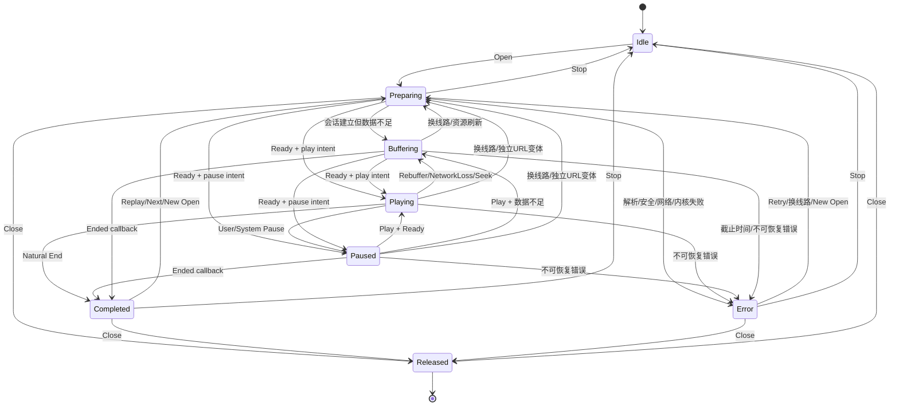

# Nexora 播放状态机

状态：`拟定，等待 M4 确认`

范围：状态、命令、事件、竞态、生命周期和恢复设计；不包含实现代码。

## 1. 目标

状态机必须保证：

- Activity 不直接管理 Player 或播放状态；
- 所有状态变化有单一写入者；
- 新播放、换线路或换独立 URL 后，旧回调不能覆盖新状态；
- 用户暂停、系统暂停和缓冲能够区分；
- 断网、超时、资源过期和解码失败有不同恢复策略；
- 旋转和界面重建不创建第二个播放器；
- 进程死亡恢复不持久化 URL、Cookie、Header 或 DRM 凭据；
- Media3 和未来 VLC 都能映射到同一状态模型。

## 2. 状态模型

### 2.1 对外主要状态

| 状态 | 进入条件 | 退出条件 |
|---|---|---|
| `Idle` | 尚未 open，或显式 Stop/ClearCurrent 后无活动项目 | 收到有效 Open |
| `Preparing` | 正在解析安全资源、创建内核项或等待首次 ready | 内核可用、开始缓冲、失败或取消 |
| `Buffering` | 媒体暂时不能按意图连续推进 | 可播放、暂停、完成、超时、失败或取消 |
| `Playing` | 内核 ready、用户意图为播放且媒体时间推进 | 暂停、缓冲、完成、切换或失败 |
| `Paused` | 会话已准备，但用户/系统策略要求不播放 | 播放、切换、完成、失败或释放 |
| `Completed` | 当前项目自然结束 | 重播、下一集、新 Open、Stop 或 Close |
| `Error` | 当前 generation 无法继续 | Retry、换线路、新 Open、Stop 或 Close |

`Preparing` 和 `Buffering` 必须分开：

- Preparing 表示尚未建立可播放会话或正在替换资源；
- Buffering 表示会话已建立但暂时没有足够媒体数据。

### 2.2 内部状态

实现可增加：

- `Recovering`：有界重试、等待网络或刷新短期资源；对 UI 可映射为带原因的 Buffering。
- `Released`：Controller close 后的内部终态；实例不可复用，后续命令被拒绝。

不要把 `Ready` 作为独立可见页面状态。内核 ready 且 `playWhenReadyIntent=true` 映射 Playing，否则映射 Paused。

### 2.3 正交字段

`PlaybackState` 除主要 phase 外还包含：

| 字段 | 作用 |
|---|---|
| `sessionId` | 一次用户可识别播放会话的脱敏 ID |
| `sessionGeneration` | 每次替换资源递增，用于拒绝旧回调 |
| `playWhenReadyIntent` | 用户是否希望播放，与内核瞬时状态分离 |
| `pauseReason?` | USER、BACKGROUND_POLICY、AUDIO_FOCUS、BECOMING_NOISY、SLEEP_TIMER |
| `bufferingReason?` | INITIAL、REBUFFER、SEEK、TRACK_SWITCH、NETWORK_LOSS、RESOURCE_REFRESH |
| `pendingOperation?` | Open、Seek、LineSwitch、VariantSwitch、TrackSwitch、Stop、Close 等 |
| `preparingStage?` | RESOLVING、SECURITY_CHECK、ENGINE_PREPARE 或 RESOURCE_REFRESH |
| `positionMs` / `bufferedPositionMs` / `durationMs?` | Long 类型时间 |
| `isLive` / `isSeekable` | prepare 后发现的能力 |
| `selectedLine` | 当前数据源线路 |
| `selectedSourceVariant` | 当前独立 URL 变体 |
| `selectedVideoTrack` | 当前 manifest 内视频轨或 Auto |
| `selectedAudioTrack` | 当前音轨 |
| `selectedSubtitle` | 当前字幕或 Off |
| `availableTracks` | 内核无关轨道快照 |
| `capabilities` | 当前会话可执行的命令集合 |
| `error?` | 稳定错误对象，不含秘密 |

状态快照必须是不可变对象；Engine 不能在 UI 已持有的集合上原地修改。

## 3. 事件与命令

### 3.1 UI/业务命令

- `Open(selection)`
- `Play`
- `Pause(reason=USER)`
- `SeekTo(positionMs)`
- `SetSpeed(speed)`
- `SetPlayerVolume(volume)`
- `SelectLine(lineId)`
- `SelectSourceVariant(variantId)`
- `SelectVideoTrack(trackId/Auto)`
- `SelectAudioTrack(trackId)`
- `SelectSubtitle(trackOrAssetId/Off)`
- `Next` / `Previous`
- `SetSleepTimer` / `CancelSleepTimer`
- `SetControlsLocked`
- `Retry`
- `Stop`（清空当前项目，Controller 可复用）
- `Close`（终止 Controller，实例不可复用）

每条命令携带 `commandId`。切资源命令还记录启动时的 generation。

### 3.2 内核事件

- `EnginePreparing`
- `EngineReady`
- `EngineBuffering`
- `EnginePlayingChanged`
- `EnginePosition`
- `EngineTracksChanged`
- `EngineTimelineDiscontinuity`
- `EngineCompleted`
- `EngineError`
- `EngineReleased`

每个事件携带 `sessionGeneration`；不匹配当前 generation 的事件无副作用。

### 3.3 系统与环境事件

- 网络丢失/恢复；
- 音频焦点获得、暂失、永久失去；
- `AUDIO_BECOMING_NOISY`（耳机拔出等）；
- App 前台/后台；
- 视频 Surface attach/detach/destroy；
- PiP 进入/退出；
- Service 创建/销毁；
- 进程恢复；
- 睡眠定时器触发。

这些事件也进入 reducer，不能由 Activity 直接调用 Engine 改变状态。

## 4. 状态图

任何活动状态收到新 `Open` 都会：

1. 增加 generation；
2. 取消旧解析、网络和 Engine 操作；
3. 清理旧轨道和 pending operation；
4. 转到 `Preparing(RESOLVING)`；
5. 保留或清除位置，依据新请求是否属于同一内容/集数。

## 5. 核心转换表

| 当前状态 | 事件 | 条件 | 下一状态 | 副作用 |
|---|---|---|---|---|
| Idle | Open | Selection 通过结构校验 | Preparing(RESOLVING) | 新 generation，调用中立 Resolver |
| Preparing | Ready | play intent=true | Playing | 开始位置更新 |
| Preparing | Ready | play intent=false | Paused | 保持用户暂停 |
| Playing | Pause(USER) | 任意 | Paused(USER) | Engine pause，落盘进度 |
| Paused(USER) | AppForeground | 任意 | Paused(USER) | 不自动播放 |
| Playing | NetworkLost | 无足够缓冲 | Buffering(NETWORK_LOSS) | 启动有界截止时间 |
| Buffering | NetworkAvailable | generation 有效 | Buffering/Playing | 继续当前请求或有限重试 |
| Buffering | DeadlineExceeded | 仍无进展 | Error(NETWORK_TIMEOUT) | 停止自动重试，提供重试/换线 |
| Playing/Paused | SeekTo | 可 seek | Buffering(SEEK) 或原状态 | 限定位置，记录 operationId |
| 任意活动状态 | SelectLine | 目标身份有效 | 原状态 + SwitchPreflight | 生成 switchOperationId，旧会话继续，异步解析/安全预检 |
| 任意活动状态 | SelectSourceVariant | 独立 URL | 原状态 + SwitchPreflight | 同上 |
| 任意活动状态 | SwitchTargetValidated | operationId 最新 | Preparing(ENGINE_PREPARE) | 此时才递增 generation，提交单 Player 替换 |
| Playing/Paused | SelectVideoTrack | 同一 manifest | 原状态或 Buffering(TRACK_SWITCH) | 不增加 session；使用 operationId |
| Playing/Paused | SelectAudio/Subtitle | Track ID 有效 | 原状态 | 更新选择；必要时短暂 Buffering |
| Playing | NaturalEnd | 队列无自动下一集 | Completed | 完成历史 |
| Playing | NaturalEnd | 自动下一集且请求成功 | Preparing | 新集、新 generation |
| 任意活动状态 | EngineError | 不可恢复 | Error | 脱敏映射，落盘进度 |
| Error | Retry | 策略允许 | Preparing | 新 generation，重新解析资源 |
| 任意非 Released | Stop | 任意 | Idle | 幂等取消当前项目、撤销资源，Controller 可复用 |
| 任意非 Released | Close | 任意 | Released | 幂等取消、解绑、释放；后续命令拒绝 |

## 6. 单写者与竞态控制

### 6.1 Reducer/Actor

`PlayerController` 内只有一个协程 actor 或等价串行 reducer 可以写 `PlaybackState`。所有来源统一封装为 `PlaybackAction`，按顺序处理：

1. 校验 sessionId/generation/operationId；
2. 计算新状态；
3. 提交不可变状态；
4. 产生 Engine、解析、历史或 UI 副作用；
5. 副作用结果再次作为 Action 返回。

副作用不得直接写 StateFlow。

### 6.2 Generation

递增 generation 的操作：

- 新影片/新集 Open；
- 目标线路预检成功并正式提交替换；
- 独立 URL 清晰度预检成功并正式提交替换；
- 资源过期后重新解析并替换资源；
- Retry 重新建立 Engine 项；
- Stop 后再次 Open。

不递增 session generation、但使用 `operationId` 的操作：

- seek；
- 同 manifest 视频轨切换；
- 音轨切换；
- 字幕切换；
- 倍速和音量。

如果切轨导致内核必须完全重建，则适配器上报 `RequiresReprepare`，Controller 再提升为新 generation。

### 6.3 过期回调示例

1. 线路 A 正在 generation 7 播放；用户选择 B，产生 switchOperationId 43，A 暂时继续。
2. 用户随后选择 C，产生 operationId 44；B 的预检结果 43 迟到时直接丢弃。
3. C 的预检通过，Controller 提交替换，generation 从 7 变为 8。
4. A 的 Engine 回调随后到达并携带 7；reducer 发现 7 != 8，丢弃结果。
5. A 的历史位置只允许写到它原有 revision，不能覆盖 C 的新进度。

这条规则同时适用于字幕、弹幕、海报元数据和资源刷新。

## 7. 详细场景

### 7.1 首次准备

1. UI 只向 Controller 发送来源中立的 `Open(PlaybackSelection)`。
2. `player:runtime` 新建 sessionId/generation，进入 `Preparing(RESOLVING)`。
3. Controller 调用注入的 `PlaybackRequestResolver`；其 `playback:orchestration` 实现再调用 Source 端口完成候选解析、安全校验和资源 Vault 登记。
4. Resolver 返回最终 `PlaybackSessionRequest`，状态进入 `Preparing(ENGINE_PREPARE)`。
5. Engine 仅在实际请求时通过 `PlaybackResourceProvider` 取得短期 resource lease 和凭据。
6. Engine 准备媒体并探测轨道。
7. Ready 后按 `playWhenReadyIntent` 进入 Playing 或 Paused。
8. 首帧时间和 prepare 耗时可记录为脱敏指标。

如果最终请求仍含 `parserUrl`、不允许的协议或不可解析/过期资源句柄，必须在 Engine 之前失败。旧 parserUrl 只能由 Source 侧批准的 `PlaybackCandidateResolver` 处理，runtime 和 Engine 永远不执行。

### 7.2 网络断开和缓冲超时

- 若已有缓冲仍可播放，保持 Playing 并标记网络不可用；
- 数据耗尽后进入 Buffering(NETWORK_LOSS)；
- 启动单调时钟截止时间和有限退避；
- 网络恢复只恢复当前 generation；
- 达到截止时间或连续无加载进度，进入可重试 Error；
- 证书错误、主机名错误、鉴权失败、非法 URL 不等待网络恢复；
- 不能因网络恢复自动覆盖用户在缓冲期间执行的 Pause。

阈值应由策略配置并经弱网测试决定，不在 API 中硬编码。

### 7.3 切换线路

采用单 Player 的两阶段流程：

1. 记录当前安全位置、播放意图和旧线路；
2. 生成新的 `switchOperationId`，旧 generation 和播放暂时保持；
3. 通过中立 Resolver 向 Source 端口解析目标线路，并完成安全策略、资源 Vault 和凭据预检；目标 resourceRef 暂时绑定 switchOperationId，不可用于实际播放；
4. 预检失败或 operationId 已过期时丢弃目标，旧会话继续；
5. 预检成功后才提交替换：递增 generation、把目标 resourceRef 激活到新 generation、撤销旧资源请求并让单一 Engine prepare 新资源；
6. Engine 成功后更新当前线路；
7. 提交后若 Engine prepare 失败，保留旧线路身份和安全位置，允许用户重新解析旧线路；由于旧 Player 项和短期凭据可能已释放，不承诺原子或无缝回滚；
8. 不自动遍历未知线路。

直播或不可 seek 媒体不保证位置迁移；UI 必须显示能力差异。

### 7.4 切换清晰度

- 同一 HLS/DASH manifest：选择视频轨或 Auto，保持 session generation。
- 数据源独立 URL：先用 switchOperationId 预检，提交时才递增 generation，并从安全位置重新 prepare。
- 目标 URL 无相同时间轴或时长差异过大时，位置需裁剪或回到安全点并提示。
- 提交前失败保持原变体；提交后失败只能按原变体身份重新解析恢复，若旧短期资源已失效则进入 Error，不能伪装成无缝回滚。

### 7.5 音轨和字幕

- 使用当前 generation 下生成的稳定业务 Track ID；
- 不保存 Media3 TrackGroup 或数组索引；
- 轨道列表变化时使过期 ID 失效并重新按语言/角色偏好匹配；
- 选择命令携带 operationId，旧选择结果不能覆盖新选择；
- 关闭字幕是 `Off`；外挂字幕加载失败不应导致视频会话崩溃。

### 7.6 App 进入后台

由已确认的产品策略决定：

- 若允许后台播放：从会话建立起就由唯一 SessionOwner/MediaSessionService 持有 Controller 和 Engine；Activity 只绑定并解绑视频 Surface，不在前后台间转交所有权；
- 若首版不启用后台播放：由 ViewModel 作用域的唯一 SessionOwner 持有，Controller 以 `Paused(BACKGROUND_POLICY)` 暂停；
- 若不允许：Controller 以 `Paused(BACKGROUND_POLICY)` 暂停，并记住这是系统策略暂停；
- 若用户此前已 Pause(USER)，不得把原因改成 BACKGROUND_POLICY；
- 后台不得由 Activity `onStop` 直接 release Player。

### 7.7 App 恢复前台

- 重新绑定 Controller/Service 和视频 Surface；
- 只有因 BACKGROUND_POLICY 自动暂停且用户意图仍为播放时，才可按策略恢复；
- Pause(USER)、AUDIO_FOCUS_LOSS 或 SLEEP_TIMER 不自动恢复；
- UI 先渲染 StateFlow 当前快照，再处理一次性事件。

### 7.8 横竖屏和配置变化

- Activity/Composable 销毁只 detach Surface 与 UI collector；
- Controller/Engine 由 ViewModel 或 Service 级 owner 持有；
- 新 UI attach 新 Surface，不重新解析 URL、不新增 session；
- 必须检测并阻止旧 Surface 回调释放新 Surface；
- 控制锁、选轨、位置和 play intent 来自 Controller 状态，不来自 Activity 字段。

### 7.9 生命周期销毁与进程重建

Controller close：

- 落盘非秘密历史；
- 取消字幕/弹幕/网络任务；
- detach Surface；
- release Engine 并进入 Released，操作幂等且实例不可复用；
- 清理内存凭据。

进程死亡恢复：

- 只读取 `sourceKey、vodId、episodeIdentity、episodeIdentityQuality、positionMs` 等安全身份；
- 重新请求详情并匹配集数；
- 重新解析短期 URL 和凭据；
- 如果来源停用、删除或身份变化，显示可理解错误；
- 不从 SavedState、Intent 或数据库恢复 URL、Header、Cookie。

### 7.10 音频焦点和耳机拔出

- 暂时焦点丢失可暂停或 duck，策略需与媒体类型一致；
- 永久焦点丢失转 Paused(AUDIO_FOCUS)；
- `AUDIO_BECOMING_NOISY` 默认暂停，防止声音从扬声器意外播放；
- 重新获得焦点只恢复“因暂时焦点丢失自动暂停”的会话；
- 来电等系统行为不应被错误记录成用户暂停。

### 7.11 Surface 丢失

- Surface 丢失不等于媒体会话失败；
- 前台视频播放可短时继续音频或按策略暂停；
- 重新 attach 前检查 generation 和 Surface token；
- Surface 长期缺失且不允许后台音频时，按生命周期策略暂停；
- Surface 操作不得阻塞 reducer。

## 8. 错误模型

建议错误族：

| 错误族 | 示例 | 自动重试 |
|---|---|---|
| `SECURITY` | TLS、主机名、非法协议、跨域凭据 | 否 |
| `AUTH` | 401、403、凭据过期 | 仅重新解析/登录，不重复旧请求 |
| `NETWORK` | 断网、DNS、连接/读取超时 | 有限、可取消 |
| `SOURCE` | 线路失效、解析失败、资源过期 | 可重新解析或换线 |
| `FORMAT` | 容器/manifest 无效 | 通常否，可换线 |
| `DECODER` | 无解码器、初始化/运行失败 | 受控 fallback 或换线 |
| `SUBTITLE` | 外挂字幕下载/解析失败 | 视频继续，字幕单独失败 |
| `DANMAKU` | 弹幕获取/解析失败 | 视频继续，弹幕单独失败 |
| `LIFECYCLE` | Surface、Service、资源释放异常 | 依场景恢复 |
| `UNKNOWN` | 未分类异常 | 默认不无限重试 |

`PlayerError` 包含：

- 稳定 code；
- retryable；
- 用户中文文案资源键；
- safeArguments；
- correlationId；
- 可选技术分类。

不得包含完整异常 `toString`、URL、Header、Cookie、服务器正文或 Media3 对象。

## 9. 位置与历史一致性

- reducer 中的位置为当前 generation 的唯一权威；
- Engine 位置采样不必每帧发出，UI 可在状态之间平滑显示；
- 历史每 15～30 秒节流，并在 pause/background/stop/close/complete 时写入；
- 写入携带 history revision，数据库用 compare-and-set 或等价规则拒绝旧 revision；
- seek 后只有 Engine 确认 discontinuity 才提交最终位置；
- Completed 写入不能被迟到的 Playing 位置覆盖。

## 10. M4 状态机验收测试

至少覆盖：

1. Idle 到 Preparing/Playing/Paused 的完整转换。
2. 用户暂停后前后台切换不会自动播放。
3. 断网、恢复和超时的虚拟时钟测试。
4. TLS/401/403 不无限重试。
5. 线路 A 迟到回调不能覆盖线路 B。
6. 旧搜索/解析/字幕/弹幕结果不能覆盖新 generation。
7. 同 manifest 清晰度和独立 URL 清晰度走不同路径。
8. 音轨/字幕旧 operationId 被丢弃。
9. 旋转不会创建第二个 Engine。
10. Surface 丢失/恢复不误判 Completed 或 Error。
11. 用户暂停、后台暂停、音频焦点暂停原因保持正确。
12. Stop/Close/cancel 重复调用幂等；Close 后所有新命令被拒绝。
13. 进程重建不读取或保存秘密。
14. 历史旧 revision 不能覆盖新进度。
15. 自动下一集失败只影响下一集，不破坏已完成记录。

在这些纯 Kotlin reducer 和 Fake Engine 测试通过前，不进入真实 Media3 状态映射。
